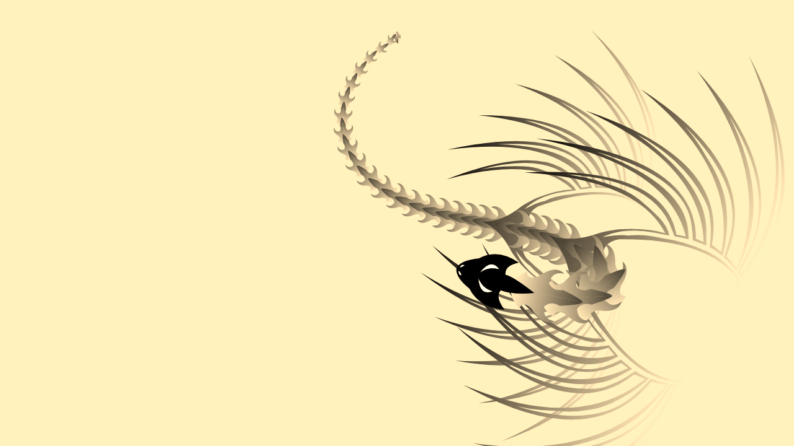

# 🐉 Interactive Dragon

A dragon built from SVG that follows your cursor (or finger) around the screen. Its body is a chain of 39 segments, each one trailing the segment ahead of it, which gives the smooth, snake-like motion. Pure HTML, CSS and vanilla JavaScript, with no libraries or build step.



## ✨ Features

- 🖱️ Dragon head chases the mouse pointer, and touch input works on mobile
- 🌀 When the pointer stops, the dragon drifts into a looping figure-eight around the centre of the screen
- 🦴 Body made of reusable SVG shapes: one head, two wing pairs and 36 spine segments
- 🎨 Gradient-shaded wings and spine with a sepia filter for the vintage look
- 📱 Responsive, fills any window size
- ⚡ Smooth animation using `requestAnimationFrame`, with no dependencies

## 🔧 How It Works

1. **Shapes are defined once** in `index.html` inside an SVG `<defs>` block: `Cabeza` (head), `Aletas` (wings) and `Espina` (spine).
2. **`script.js` creates 39 `<use>` elements** that reuse those shapes: the head at position 1, wings at positions 8 and 14, and spine pieces everywhere else.
3. **Every frame**, the lead element eases toward the pointer. Each following segment then moves toward the one in front of it while keeping a fixed distance.
4. **Rotation and scale** are recalculated for every segment, so the body bends naturally and tapers towards the tail.
5. **Idle motion:** the `rad` value grows over time and adds a Lissajous-style offset (`cos(3t)`, `sin(4t)`), which is what makes the dragon loop around by itself.

## 📁 Project Structure

```
interactive-dragon/
├── index.html            # Page + SVG shape definitions
├── css/
│   └── style.css         # Layout and sepia styling
├── js/
│   └── script.js         # Animation logic
├── docs/
│   └── screenshots/
│       └── demo.png
├── .gitignore
└── README.md
```

## 🚀 Run Locally

No install needed. Clone the repo and open `index.html` in your browser:

```bash
git clone https://github.com/<your-username>/interactive-dragon.git
cd interactive-dragon
# then double-click index.html, or serve it:
python -m http.server 8000   # open http://localhost:8000
```

## 🌐 Deploy with GitHub Pages

1. Push the project to GitHub.
2. Go to **Settings → Pages**.
3. Under **Source**, choose the `main` branch and the `/ (root)` folder, then save.
4. Your live demo appears at `https://<your-username>.github.io/interactive-dragon/`. Add that link to this README.

## 🛠️ Customize

| Want to change | Edit |
|---|---|
| Dragon length | `const N = 40` in `js/script.js` |
| How tightly it follows the cursor | The divisors `/ 10` (head) and `/ 4` (body) in `run()` |
| Body size and taper | The scale formula `s = (162 + 4 * (1 - i)) / 50` |
| Background colour or look | `css/style.css`; remove `filter: sepia()` for full colour |

## 🛠️ Tech Stack

HTML5 · CSS3 · SVG · JavaScript (ES6)

## 🙌 Credits

<!-- If this animation is based on someone else's work (for example a CodePen), credit the original author and link to the source here. -->
Original concept and code: <author name / link>

Modified and packaged by <Your Name>.
